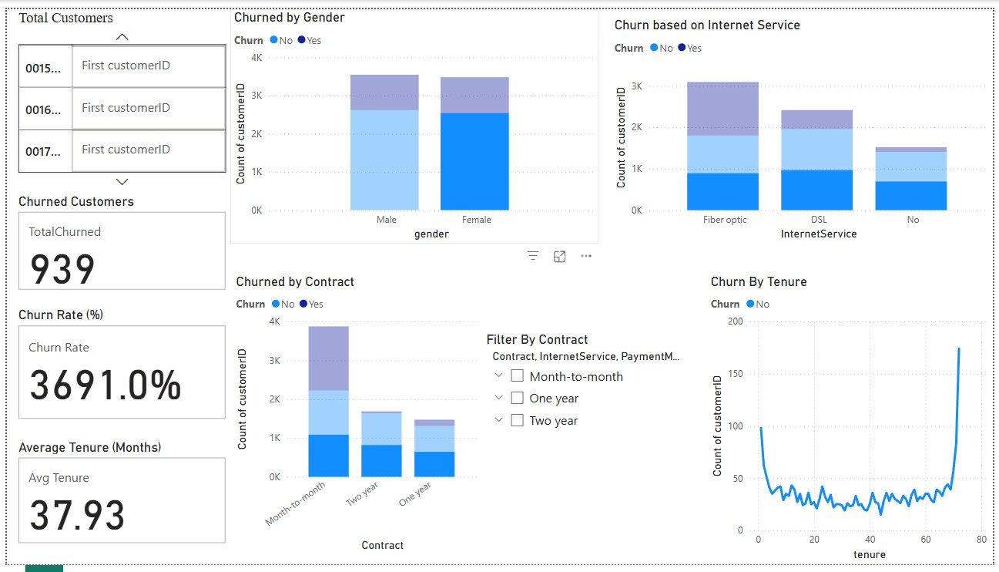

# Customer Churn Dashboard – Power BI Project

This is an end-to-end Business Intelligence dashboard built using **Power BI**, designed to analyze and visualize **customer churn patterns** using real-world telecom data.

---

## Project Structure

- `Customer Churn Dashboard.pbix` → Main Power BI dashboard file
- `Customer Churn Dashboard Insights.pdf` → Exported dashboard insights
- `Screenshot_1.jpg` → Screenshot of final dashboard
- `Project Summary` → Project overview, KPIs, and business insights

---

## Tools Used

- Power BI (Data modeling, DAX, Power Query)
- DAX Measures
- Power Query Editor
- Kaggle Dataset: [Telco Customer Churn](https://www.kaggle.com/datasets/blastchar/telco-customer-churn)

---

## Objective

To help telecom business stakeholders **identify churn risks**, explore customer behavior, and recommend data-backed strategies to reduce churn.

---

## Key Metrics & Visuals

- **KPIs**: Total Customers, Churned Customers, Churn Rate (%), Avg. Tenure
- **Visuals**: Churn by Gender, Contract Type, Internet Service, Tenure
- **Slicers**: Contract, Internet Service, Payment Method, Senior Citizen

---

## Insights

- Highest churn occurs in **Month-to-Month** contracts
- **Fiber Optic** users are more likely to churn
- Churn is highest during **first 10–12 months**
- **Electronic Check** payments link to higher churn

---

## Outcome

A fully interactive and insightful dashboard ready for stakeholders or client delivery.

---

## Preview

---

## Contact

**Saakshi Sharma**  
saakshisharma2101@gmail.com  
Jaipur, India  
